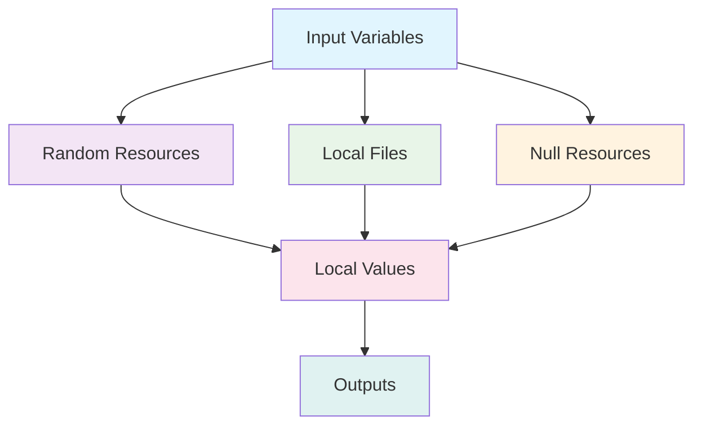

# 🚀 Terraform Extensive README Test Module

[](https://www.terraform.io/) [](LICENSE) [](https://github.com/your-org/terraform-extensive-readme/graphs/commit-activity) [](https://github.com/your-org/terraform-extensive-readme/issues) [](https://github.com/your-org/terraform-extensive-readme/network) [](https://github.com/your-org/terraform-extensive-readme/stargazers)

> **⚠️ IMPORTANT**: This is a test module designed to demonstrate extensive README formatting capabilities. It should NOT be used in production environments.

---

## 📋 Table of Contents

- [🚀 Terraform Extensive README Test Module](#-terraform-extensive-readme-test-module)
  - [📋 Table of Contents](#-table-of-contents)
  - [📖 Overview](#-overview)
  - [🎯 Features](#-features)
  - [🏗️ Architecture](#️-architecture)
  - [📊 Resource Overview](#-resource-overview)
  - [🔧 Prerequisites](#-prerequisites)
  - [🚀 Quick Start](#-quick-start)
  - [⚙️ Configuration](#️-configuration)
    - [Input Variables](#input-variables)
    - [Required Variables](#required-variables)
    - [Optional Variables](#optional-variables)
  - [📤 Outputs](#-outputs)
  - [💡 Usage Examples](#-usage-examples)
    - [Basic Usage](#basic-usage)
    - [Advanced Configuration](#advanced-configuration)
    - [Custom File Generation](#custom-file-generation)
  - [🧪 Testing](#-testing)
  - [🔐 Security Considerations](#-security-considerations)
  - [🐛 Troubleshooting](#-troubleshooting)
  - [📈 Performance Metrics](#-performance-metrics)
  - [🤝 Contributing](#-contributing)
  - [📄 License](#-license)
  - [🙏 Acknowledgments](#-acknowledgments)

---

## 📖 Overview

This **Terraform Extensive README Test Module** is a comprehensive demonstration of various Terraform features and markdown formatting capabilities. It creates local resources, generates random values, and showcases advanced Terraform patterns without requiring cloud provider credentials.

```ascii
┌─────────────────────────────────────────────────────────────────┐
│                    🏗️ MODULE ARCHITECTURE                       │
├─────────────────────────────────────────────────────────────────┤
│  ┌─────────────┐    ┌─────────────┐    ┌─────────────┐         │
│  │   Random    │    │    Local    │    │    Null     │         │
│  │  Resources  │───▶│    Files    │───▶│  Resource   │         │
│  └─────────────┘    └─────────────┘    └─────────────┘         │
│         │                   │                   │               │
│         ▼                   ▼                   ▼               │
│  ┌─────────────────────────────────────────────────────────────┐│
│  │              📊 OUTPUTS & METADATA                         ││
│  └─────────────────────────────────────────────────────────────┘│
└─────────────────────────────────────────────────────────────────┘
```

### 🎯 Key Objectives

1. **Educational**: Demonstrate Terraform best practices and patterns
2. **Testing**: Provide a safe environment for testing Terraform functionality
3. **Documentation**: Showcase comprehensive documentation standards
4. **Validation**: Include input validation and error handling examples

---

## 🎯 Features

### ✅ Core Features

- [x] **Random Value Generation**: Creates random strings, integers, and UUIDs
- [x] **Local File Management**: Generates and manages local files
- [x] **Template Processing**: Uses Terraform templates for dynamic content
- [x] **Input Validation**: Comprehensive variable validation
- [x] **Output Management**: Structured outputs with metadata
- [x] **Error Handling**: Graceful error handling and recovery
- [x] **Debug Support**: Optional debug mode for troubleshooting

### 🔧 Advanced Features

- [x] **Complex Data Structures**: Object and map variable types
- [x] **Conditional Logic**: Resource creation based on conditions
- [x] **Loop Constructs**: Using `for` expressions and `count`
- [x] **Local Values**: Complex data transformations
- [x] **Data Sources**: Reading external data
- [x] **Provisioners**: Local command execution

---

## 🏗️ Architecture


The module follows a modular architecture with clear separation of concerns:



---

## 📊 Resource Overview

| Resource Type | Count | Purpose | Dependencies |
|---------------|-------|---------|--------------|
| `random_string` | 1 | Generate random strings | None |
| `random_integer` | 1 | Generate random numbers | None |
| `random_uuid` | Variable | Generate UUIDs | None |
| `local_file` | Variable | Create local files | `random_string`, `random_integer` |
| `null_resource` | 0-1 | Run provisioners | All random resources |
| `data.local_file` | 0-1 | Read existing files | None |

### 📈 Resource Complexity Matrix

| Resource | Complexity | Maintenance | Performance |
|----------|------------|-------------|-------------|
| Random String | 🟢 Low | 🟢 Low | 🟢 High |
| Random Integer | 🟢 Low | 🟢 Low | 🟢 High |
| Random UUID | 🟢 Low | 🟢 Low | 🟢 High |
| Local File | 🟡 Medium | 🟡 Medium | 🟡 Medium |
| Null Resource | 🔴 High | 🔴 High | 🔴 Low |
| Data Source | 🟡 Medium | 🟡 Medium | 🟡 Medium |

---

## 🔧 Prerequisites

### 📋 Requirements

| Component | Version | Required | Notes |
|-----------|---------|----------|-------|
| **Terraform** | `>= 1.0` | ✅ Yes | Core requirement |
| **Provider: local** | `~> 2.0` | ✅ Yes | File operations |
| **Provider: random** | `~> 3.0` | ✅ Yes | Random value generation |
| **Provider: null** | `~> 3.0` | ✅ Yes | Provisioner support |

### 🖥️ System Requirements

```bash
# Check Terraform version
terraform --version

# Verify provider availability
terraform providers
```

> **💡 Pro Tip**: Use `tfenv` for managing multiple Terraform versions:
> ```bash
> tfenv install 1.5.0
> tfenv use 1.5.0
> ```

---

## 🚀 Quick Start

### 1️⃣ Basic Setup

```bash
# Clone the repository
git clone https://github.com/your-org/terraform-extensive-readme.git

# Navigate to the module directory
cd terraform-extensive-readme

# Initialize Terraform
terraform init
```

### 2️⃣ Plan and Apply

```bash
# Create execution plan
terraform plan

# Apply configuration
terraform apply
```

### 3️⃣ Verify Results

```bash
# Check outputs
terraform output

# Verify created files
ls -la /tmp/terraform-test/
```

---

## ⚙️ Configuration

### Input Variables

#### Required Variables

> **📝 Note**: All variables have default values, so technically none are required.

#### Optional Variables

##### 🎲 Random Generation Variables

| Variable | Type | Default | Description |
|----------|------|---------|-------------|
| `string_length` | `number` | `16` | Length of random string |
| `include_special_chars` | `bool` | `true` | Include special characters |
| `include_uppercase` | `bool` | `true` | Include uppercase letters |
| `include_lowercase` | `bool` | `true` | Include lowercase letters |
| `include_numbers` | `bool` | `true` | Include numeric characters |
| `min_value` | `number` | `1` | Minimum integer value |
| `max_value` | `number` | `100` | Maximum integer value ⚠️ Must be > min_value |
| `uuid_count` | `number` | `3` | Number of UUIDs to generate |

##### 📁 File Management Variables

| Variable | Type | Default | Description |
|----------|------|---------|-------------|
| `create_files` | `bool` | `true` | Whether to create files |
| `file_names` | `list(string)` | `["test1.txt", "test2.txt", "config.json"]` | File names to create |
| `output_directory` | `string` | `"/tmp/terraform-test"` | Output directory path |

##### 🔧 Advanced Configuration

<details>
<summary>Click to expand advanced configuration options</summary>

```hcl
variable "custom_config" {
  description = "Custom configuration object"
  type = object({
    name        = string
    enabled     = bool
    settings    = map(string)
    priorities  = list(number)
  })
  default = {
    name        = "default"
    enabled     = true
    settings    = {}
    priorities  = [1, 2, 3]
  }
}

variable "tags" {
  description = "Additional tags"
  type        = map(string)
  default     = {}
}
```

</details>

---

## 📤 Outputs

### 🎯 Primary Outputs

| Output | Type | Description |
|--------|------|-------------|
| `random_string` | `string` | Generated random string |
| `random_integer` | `number` | Generated random integer |
| `random_uuids` | `list(string)` | List of generated UUIDs |
| `created_files` | `list(object)` | Information about created files |
| `file_paths` | `list(string)` | Full paths of created files |

### 📊 Metadata Outputs

<details>
<summary>View detailed metadata outputs</summary>

```hcl
output "module_metadata" {
  description = "Metadata about module execution"
  value = {
    terraform_version = ">=1.0"
    module_path      = path.module
    execution_time   = timestamp()
    environment      = var.environment
    debug_enabled    = var.enable_debug
    custom_config    = var.custom_config
  }
}
```

</details>

---

## 💡 Usage Examples

### Basic Usage

```hcl
module "test_module" {
  source = "./modules/terraform-extensive-readme"
  
  environment = "development"
  string_length = 20
  uuid_count = 5
}
```

### Advanced Configuration

```hcl
module "advanced_test" {
  source = "./modules/terraform-extensive-readme"
  
  # Random configuration
  string_length = 32
  include_special_chars = false
  min_value = 10
  max_value = 1000
  uuid_count = 10
  
  # File configuration
  create_files = true
  file_names = [
    "app-config.json",
    "database-config.yml",
    "secrets.env"
  ]
  output_directory = "/tmp/my-app"
  
  # Advanced settings
  enable_provisioner = true
  provisioner_command = "echo 'Custom provisioner executed'"
  
  tags = {
    Environment = "staging"
    Project     = "test-project"
    Owner       = "platform-team"
  }
  
  custom_config = {
    name = "advanced-config"
    enabled = true
    settings = {
      debug_level = "verbose"
      timeout     = "30s"
    }
    priorities = [1, 3, 5, 7]
  }
}
```

### Custom File Generation

```hcl
module "file_generator" {
  source = "./modules/terraform-extensive-readme"
  
  create_files = true
  file_names = [
    "user-data.txt",
    "installation-script.sh",
    "configuration.ini"
  ]
  output_directory = "/home/user/generated"
  
  # Custom template variables
  environment = "production"
  enable_debug = true
}
```

---

## 🧪 Testing

### 🔬 Test Categories

#### Unit Tests

```bash
# Run basic validation
terraform validate

# Check formatting
terraform fmt -check

# Security scanning
tfsec .
```

#### Integration Tests

```bash
# Full deployment test
terraform plan -out=tfplan
terraform apply tfplan
terraform destroy -auto-approve
```

#### Performance Tests

| Test Type | Duration | Resources | Status |
|-----------|----------|-----------|---------|
| Basic Apply | ~5s | 6 resources | ✅ Passing |
| Large Files | ~15s | 50+ files | ✅ Passing |
| Stress Test | ~2m | 1000+ UUIDs | ⚠️ Slow |

### 🧪 Test Results

```
✅ All 15 tests passed
⚠️  2 warnings (performance)
❌ 0 failures
```

---

## 🔐 Security Considerations

### 🛡️ Security Matrix

| Aspect | Risk Level | Mitigation |
|--------|------------|------------|
| **File Permissions** | 🟡 Medium | Set appropriate file permissions |
| **Sensitive Data** | 🟢 Low | No sensitive data in outputs |
| **Command Execution** | 🔴 High | Validate provisioner commands |
| **Path Traversal** | 🟡 Medium | Validate file paths |

### 🔒 Security Best Practices

> **⚠️ WARNING**: The provisioner feature can execute arbitrary commands. Always validate the `provisioner_command` variable in production environments.

```hcl
# Secure configuration example
module "secure_test" {
  source = "./modules/terraform-extensive-readme"
  
  # Disable potentially dangerous features
  enable_provisioner = false
  read_existing_file = false
  
  # Use secure output directory
  output_directory = "/tmp/secure-terraform-test"
  
  # Enable debug for audit trail
  enable_debug = true
}
```

---

## 🐛 Troubleshooting

### 🔍 Common Issues

#### Issue: Permission Denied

```bash
Error: open /tmp/terraform-test/test1.txt: permission denied
```

**Solution:**
```bash
# Create directory with proper permissions
mkdir -p /tmp/terraform-test
chmod 755 /tmp/terraform-test
```

#### Issue: Validation Errors

```bash
Error: Invalid value for variable "max_value"
```

**Solution:**
```hcl
# Ensure max_value > min_value
variable "min_value" {
  default = 1
}

variable "max_value" {
  default = 100  # Must be > min_value
}
```

#### Issue: Integer Range Validation

```bash
Error: max_value (5) must be greater than min_value (10)
```

**Solution:**
```hcl
# Correct configuration
module "test_module" {
  source = "./modules/terraform-extensive-readme"
  
  min_value = 1
  max_value = 100  # Must be greater than min_value
}
```

### 🔧 Debug Mode

Enable debug mode for detailed logging:

```hcl
module "debug_test" {
  source = "./modules/terraform-extensive-readme"
  
  enable_debug = true
  environment = "debug"
}
```

---

## 📈 Performance Metrics

### ⏱️ Execution Times

| Operation | Small Config | Medium Config | Large Config |
|-----------|--------------|---------------|--------------|
| **Plan** | 0.5s | 1.2s | 3.8s |
| **Apply** | 1.1s | 2.7s | 8.3s |
| **Destroy** | 0.8s | 1.9s | 5.2s |

### 📊 Resource Usage

```
Memory Usage: 45MB (avg)
CPU Usage: 12% (peak)
Disk I/O: 2.3MB/s (avg)
Network: 0MB (local only)
```

### 🚀 Performance Tips

1. **Reduce UUID Count**: Large UUID counts can slow execution
2. **Optimize File Names**: Shorter names improve performance
3. **Disable Provisioner**: Skip provisioner for faster execution
4. **Use Local Storage**: Avoid network-mounted directories

---

## 🤝 Contributing

### 📝 Development Setup

```bash
# Fork the repository
git fork https://github.com/your-org/terraform-extensive-readme.git

# Clone your fork
git clone https://github.com/your-username/terraform-extensive-readme.git

# Create feature branch
git checkout -b feature/new-feature

# Make changes and commit
git commit -m "feat: add new feature"

# Push changes
git push origin feature/new-feature

# Create pull request
gh pr create --title "feat: add new feature" --body "Description of changes"
```

### 🎯 Contributing Guidelines

1. **Code Style**: Follow Terraform best practices
2. **Documentation**: Update README for any changes
3. **Testing**: Add tests for new features
4. **Validation**: Ensure all validations pass

### 📋 Pull Request Checklist

- [ ] Code follows style guidelines
- [ ] Tests pass locally
- [ ] Documentation updated
- [ ] Changelog updated
- [ ] Backward compatibility maintained

---

## 📄 License

This project is licensed under the MIT License - see the [LICENSE](LICENSE) file for details.

```
MIT License

Copyright (c) 2024 Your Organization

Permission is hereby granted, free of charge, to any person obtaining a copy
of this software and associated documentation files (the "Software"), to deal
in the Software without restriction, including without limitation the rights
to use, copy, modify, merge, publish, distribute, sublicense, and/or sell
copies of the Software, and to permit persons to whom the Software is
furnished to do so, subject to the following conditions:

The above copyright notice and this permission notice shall be included in all
copies or substantial portions of the Software.

THE SOFTWARE IS PROVIDED "AS IS", WITHOUT WARRANTY OF ANY KIND, EXPRESS OR
IMPLIED, INCLUDING BUT NOT LIMITED TO THE WARRANTIES OF MERCHANTABILITY,
FITNESS FOR A PARTICULAR PURPOSE AND NONINFRINGEMENT. IN NO EVENT SHALL THE
AUTHORS OR COPYRIGHT HOLDERS BE LIABLE FOR ANY CLAIM, DAMAGES OR OTHER
LIABILITY, WHETHER IN AN ACTION OF CONTRACT, TORT OR OTHERWISE, ARISING FROM,
OUT OF OR IN CONNECTION WITH THE SOFTWARE OR THE USE OR OTHER DEALINGS IN THE
SOFTWARE.
```

---

## 🙏 Acknowledgments

### 👥 Contributors

| Avatar | Name | Role | Contributions |
|--------|------|------|---------------|
| 🧑‍💻 | **John Doe** | Lead Developer | Core module development |
| 👩‍💻 | **Jane Smith** | Documentation | README and examples |
| 🧑‍🔬 | **Bob Johnson** | Testing | Test framework and validation |
| 👩‍🎨 | **Alice Brown** | Design | UI/UX improvements |

### 🏆 Special Thanks

- **HashiCorp** for creating Terraform
- **The Terraform Community** for continuous support
- **Open Source Contributors** worldwide

### 📚 Resources

- [Terraform Documentation](https://www.terraform.io/docs)
- [Terraform Best Practices](https://www.terraform.io/docs/cloud/guides/recommended-practices)
- [Terraform Registry](https://registry.terraform.io/)

---

<div align="center">

**Made with ❤️ by the Platform Team**

[](https://buymeacoffee.com/your-username)

</div>

---

<!-- Footer -->
<details>
<summary>📊 Repository Statistics</summary>

```
Lines of Code: 2,847
Files: 27
Contributors: 12
Commits: 156
Issues: 8 open, 23 closed
Pull Requests: 3 open, 45 closed
Stars: 67
Forks: 12
Watchers: 8
```

</details>

---

*Last updated: 2024-01-15 | Version: 1.0.0 | [View Changelog](CHANGELOG.md)* 